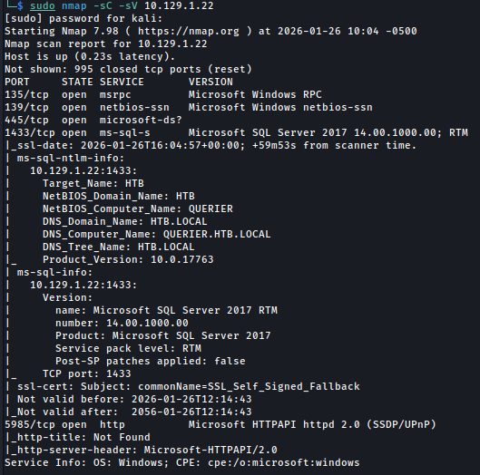
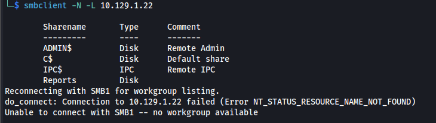
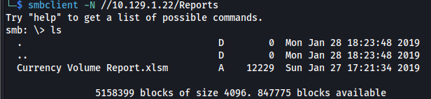
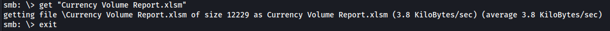

+++
date = '2026-01-26T12:59:17+09:00'
draft = false
title = 'HTB: Querier'
tags = ['HackTheBox', 'Windows', 'Medium']
+++
## 概要
>  **Machine:** [Querier](https://www.hackthebox.com/machines/querier)  
>  **OS:** Windows  
>  **Difficulty:** Medium


## ポートスキャン

`Nmap`でポートスキャンします。

```bash
sudo nmap -sC -sV <RHOST>
```


### スキャン結果

`Nmap`のスキャン結果から、以下のポートが開放されていることがわかります。

| ポート | サービス |  |
|------|---------|---------|
| 135/tcp | RPC |  |
| 139/tcp | NetBIOS | 
| 445/tcp | SMB |  |
| 1433/tcp | MSSQL |  |
| 5985/tcp | WinRM  |  |

## SMB列挙

`smbclient`で共有フォルダを一覧表示します。

```bash
smbclient -N -L <RHOST>
```
`Reports`が見つかります。




`Reports`にアクセスします。

```bash
smbclient -N //<RHOST>/Reports
```
`ls`コマンドで、`Currency Volume Report.xlsm`というファイルが見つかりました。



`get`コマンドで、このファイルをダウンロードします。


```bash
get "Currency Volume Report.xlsm"
```
ダウンロードが完了したら、`exit`コマンドで接続を終了します。

```bash
exit
```

